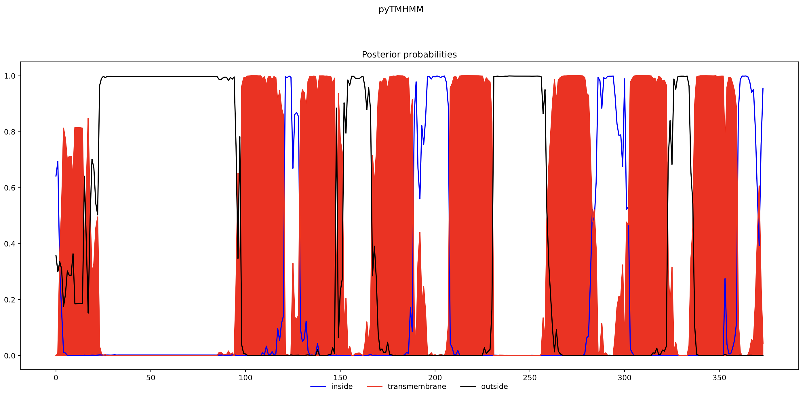

# pyTMHMM

pyTMHMM is a Python 3.5+/Cython implementation of the transmembrane helix predictor using a
hidden Markov model ([TMHMM](http://www.cbs.dtu.dk/services/TMHMM/)) originally
described in:

E.L. Sonnhammer, G. von Heijne, and A. Krogh. **A hidden Markov model for
predicting transmembrane helices in protein sequences**. In J. Glasgow,
T. Littlejohn, F. Major, R. Lathrop, D. Sankoff, and C. Sensen, editors,
Proceedings of the Sixth International Conference on Intelligent Systems for
Molecular Biology, pages 175-182, Menlo Park, CA, 1998. AAAI Press. PMID [9783223](https://pubmed.ncbi.nlm.nih.gov/9783223/)

## History

[Dan Søndergaard](https://github.com/dansondergaard) is the original author of this 
package and his repository is now [archived](https://github.com/dansondergaard/tmhmm.py). Dan wrote this code for a few reasons:

- the source code is not available as part of the publication
- the downloadable binaries are Linux-only
- the downloadable binaries may not be redistributed, so it's not possible to
  put them in a Docker image or a VM for other people to use
- there is a need to predict transmembrane helices in a scripted, automated way

This Python implementation includes a parser for the undocumented file format
used to describe the model and a fast Cython implementation of the
Viterbi algorithm used to perform the annotation. The tool will output files
similar to the files produced by the original TMHMM implementation.

## Incompatibilities

* The original TMHMM implementation handles ambigious characters and gaps in an
  undocumented way. However, `pyTMHMM` does not attempt to handle such
  characters at all and will fail. A possible fix is to replace those
  characters with something also based on expert/domain knowledge.

## Installation

This package supports Python 3.5 or greater. Install with:

    > pip install pyTMHMM

## Command Line Usage

    > pyTMHMM -h
    usage: pyTMHMM [-h] -f SEQUENCE_FILE [-m MODEL_FILE] [-p]

    required arguments:
    -f SEQUENCE_FILE, --file SEQUENCE_FILE
                        path to file in fasta format with sequences

    optional arguments:
    -h, --help          show this help message and exit
    -m MODEL_FILE, --model MODEL_FILE
                        path to the model to use (default: TMHMM2.0.model)
    -p, --plot          plot posterior probabilies

The `-p`/`--plot` option requires `matplotlib`.

The input sequence file should have one or more sequences in Fasta format, for example:

    > head PAR3_HUMAN.fasta
    >sp|O00254|PAR3_HUMAN Proteinase-activated receptor 3 OS=Homo sapiens OX=9606 GN=F2RL2 PE=1 SV=1
    MKALIFAAAGLLLLLPTFCQSGMENDTNNLAKPTLPIKTFRGAPPNSFEEFPFSALEGWT
    GATITVKIKCPEESASHLHVKNATMGYLTSSLSTKLIPAIYLLVFVVGVPANAVTLWMLF
    FRTRSICTTVFYTNLAIADFLFCVTLPFKIAYHLNGNNWVFGEVLCRATTVIFYGNMYCS
    ILLLACISINRYLAIVHPFTYRGLPKHTYALVTCGLVWATVFLYMLPFFILKQEYYLVQP
    DITTCHDVHNTCESSSPFQLYYFISLAFFGFLIPFVLIIYCYAAIIRTLNAYDHRWLWYV
    KASLLILVIFTICFAPSNIILIIHHANYYYNNTDGLYFIYLIALCLGSLNSCLDPFLYFL
    MSKTRNHSTAYLTK

Example command:

    > pyTMHMM -f PAR3_HUMAN.fasta

This produces three files for each sequence in the Fasta file, named by id.

### Summary file

The coordinates of the predicted domains:

    > cat sp|O00254|PAR3_HUMAN.summary 
    0 97 outside
    98 120 transmembrane helix
    121 128 inside
    129 151 transmembrane helix
    152 165 outside
    166 188 transmembrane helix
    189 207 inside
    208 230 transmembrane helix
    231 259 outside
    260 282 transmembrane helix
    283 302 inside
    303 322 transmembrane helix
    323 336 outside
    337 359 transmembrane helix
    360 373 inside

### Annotation file

An annotated sequence in Fasta-like format:

    > cat sp|O00254|PAR3_HUMAN.annotation 
    >sp|O00254|PAR3_HUMAN Proteinase-activated receptor 3 OS=Homo sapiens OX=9606 GN=F2RL2 PE=1 SV=1
    OOOOOOOOOOOOOOOOOOOOOOOOOOOOOOOOOOOOOOOOOOOOOOOOOOOOOOOOOOOOOOOOOOOOOOOOOOOOOOO
    OOOOOOOOOOOOOOOOOOOMMMMMMMMMMMMMMMMMMMMMMMiiiiiiiiMMMMMMMMMMMMMMMMMMMMMMMoooooo
    ooooooooMMMMMMMMMMMMMMMMMMMMMMMiiiiiiiiiiiiiiiiiiiMMMMMMMMMMMMMMMMMMMMMMMoooooo
    oooooooooooooooooooooooMMMMMMMMMMMMMMMMMMMMMMMiiiiiiiiiiiiiiiiiiiiMMMMMMMMMMMMM
    MMMMMMMooooooooooooooMMMMMMMMMMMMMMMMMMMMMMMiiiiiiiiiiiiii

### Posterior probabilities file

A file containing the posterior probabilities for each label:

    > head sp|O00254|PAR3_HUMAN.plot 
    inside membrane outside
    0.6417636608794935 0.0 0.3582363391205064
    0.693933311909457 0.006819179965744769 0.2992475081247982
    0.3041488405999551 0.36045181385397806 0.3353993455460668
    0.15867304975718463 0.5320740444690139 0.3092529057738015
    0.011878169861623369 0.8126781067794638 0.1754437233589128
    0.009103844612501565 0.7722962064006578 0.21859994898684057
    0.0008287471596339259 0.6966223976666195 0.3025488551737467
    0.0007860447761827514 0.7122010989508554 0.2870128562729619
    0.0006349307902653272 0.712364526792757 0.28700054241697776

### Optional plot file

If the `-p` flag is set and `matplotlib` is installed a plot in PDF format is made:

[doc/sp|O00254|PAR3_HUMAN.pdf](doc/PAR3_HUMAN.pdf)

## API Usage

You can also use `pyTMHMM` as a library:

    import pyTMHMM
    annotation, posterior = pyTMHMM.predict(sequence_string)

This returns the annotation as a string and the posterior probabilities for
each label as a numpy array with shape `(len(sequence), 3)` where column 0, 1
and 2 corresponds to being inside, transmembrane and outside, respectively.

If you don't need the posterior probabilities set `compute_posterior=False`,
this will save computation:

    annotation = pyTMHMM.predict(
        sequence_string, compute_posterior=False
    )
